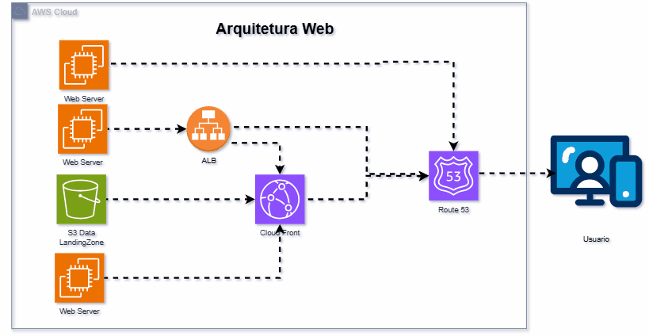

# Arquitetura Web AWS com Terraform

Este repositório contém a infraestrutura como código (IaC) para implementar uma arquitetura web completa na AWS usando Terraform.

## Visão Geral da Arquitetura


A arquitetura implementa uma aplicação web escalável e resiliente com os seguintes componentes:


- **Múltiplos Web Servers**: Servidores web distribuídos para garantir alta disponibilidade
- **Application Load Balancer (ALB)**: Balanceamento de carga entre os servidores web
- **Amazon S3**: Bucket para armazenamento de dados estáticos (Landing Zone)
- **Amazon CloudFront**: CDN para distribuição de conteúdo com baixa latência
- **Amazon Route 53**: Serviço DNS para gerenciamento de domínio e roteamento

## Diagrama da Arquitetura

A arquitetura implementada neste projeto segue o diagrama disponível no arquivo `Arquitetura.drawio`. O fluxo de comunicação começa com os usuários acessando a aplicação através do Route 53, que direciona para os recursos adequados através do CloudFront e do ALB, conectando-se a múltiplos servidores web e ao bucket S3 para conteúdo estático.

## Pré-requisitos

- [Terraform](https://www.terraform.io/downloads.html) (versão >= 1.0.0)
- [AWS CLI](https://aws.amazon.com/cli/) configurado com credenciais apropriadas
- Conta AWS com permissões para criar recursos

## Estrutura do Projeto

```
.
├── modules/                        # Módulos reutilizáveis
│   ├── app_ec2/                    # Módulo para instâncias EC2
│   ├── app_ec2_cloudfront/         # Módulo para EC2 com CloudFront
│   ├── app_ec2_lb/                 # Módulo para EC2 com Load Balancer
│   ├── app_ec2_lb_cloudfront/      # Módulo para EC2 com LB e CloudFront
│   └── app_s3_cloudfront/          # Módulo para S3 com CloudFront
├── variables/                      # Arquivos de variáveis
├── _backend.tf                     # Configuração de backend remoto
├── _provider.tf                    # Configuração do provider AWS
├── _variables.tf                   # Definição de variáveis globais
├── main.tf                         # Configuração principal do Terraform
├── Arquitetura.drawio              # Diagrama da arquitetura
├── Arquitetura.gif                 # Demonstração visual da arquitetura
└── data.tf                         # Definições de datasources
```

## Módulos Disponíveis

### app_ec2
Provisiona instâncias EC2 para hospedar aplicações web.

**Recursos:**
- Instâncias EC2
- Security Groups
- IAM Roles e políticas necessárias

### app_ec2_cloudfront
Provisiona instâncias EC2 integradas com CloudFront para distribuição de conteúdo.

**Recursos:**
- Instâncias EC2
- Distribuição CloudFront
- Origin Access Identity
- Certificados SSL/TLS

### app_ec2_lb
Provisiona instâncias EC2 com um Application Load Balancer.

**Recursos:**
- Instâncias EC2
- Application Load Balancer
- Target Groups
- Security Groups específicos

### app_ec2_lb_cloudfront
Solução completa combinando EC2, Load Balancer e CloudFront.

**Recursos:**
- Instâncias EC2
- Application Load Balancer
- Distribuição CloudFront
- Integração com certificados SSL/TLS

### app_s3_cloudfront
Provisiona bucket S3 para conteúdo estático com distribuição CloudFront.

**Recursos:**
- Bucket S3
- Políticas de bucket
- Distribuição CloudFront
- Origin Access Identity

## Como Usar

### Inicialização

```bash
# Inicializar o diretório de trabalho do Terraform
terraform init
```

### Planejamento

```bash
# Verificar as alterações que serão aplicadas
terraform plan -var-file="_variables/terraform.tfvars"
```

### Aplicação

```bash
# Aplicar as alterações
terraform apply -auto-approve -var-file="_variables/terraform.tfvars"
```

### Destruição

```bash
# Destruir a infraestrutura quando não for mais necessária
terraform destroy -auto-approve -var-file="_variables/terraform.tfvars"
```

## Configuração de Estado Remoto

O projeto utiliza um backend remoto para armazenar o estado do Terraform, conforme configurado no arquivo `_backend.tf`. Isso permite colaboração em equipe e maior segurança para o estado da infraestrutura.

## Variáveis de Configuração

As variáveis são definidas no arquivo `_variables.tf` e podem ser personalizadas conforme necessário para cada ambiente. Consulte este arquivo para conhecer todas as variáveis disponíveis e seus valores padrão.

## Saídas

Ao executar `terraform apply`, o projeto gera saídas úteis como:

- URLs de acesso para a aplicação
- Endpoint do ALB
- Domínio do CloudFront
- Outros recursos relevantes para acessar e gerenciar a infraestrutura

## Melhores Práticas Implementadas

- **Estado Remoto**: Armazenamento do estado do Terraform com mecanismo de bloqueio
- **Modularização**: Código organizado em módulos reutilizáveis para diferentes componentes da arquitetura
- **Organização de Arquivos**: Separação clara entre providers, variáveis e recursos
- **Prefixo de Underscore**: Arquivos com prefixo `_` (como `_provider.tf`) indicam configurações globais

## Considerações de Segurança

- Acesso HTTPS aplicado em todas as comunicações externas
- Web Servers configurados com grupos de segurança apropriados
- CloudFront configurado para proteger origens diretas
- S3 configurado com políticas de acesso adequadas

## Monitoramento e Logs

- CloudWatch para monitoramento de métricas e logs
- Possibilidade de integração com serviços de observabilidade

## Backup e Recuperação

O projeto mantém backups automáticos do estado do Terraform, conforme evidenciado pelo arquivo `terraform.tfstate.backup`.

## Resolução de Problemas

### Problemas de Bloqueio de Estado
Se encontrar problemas relacionados ao bloqueio de estado (`terraform.tfstate.lock.info`), você pode forçar o desbloqueio:

```bash
terraform force-unlock LOCK_ID
```

### Refresh do Estado
Se o estado local ficar dessincronizado com a infraestrutura real:

```bash
terraform refresh
```

## Contribuição

1. Fork o repositório
2. Crie uma branch para sua feature (`git checkout -b feature/nova-feature`)
3. Commit suas alterações (`git commit -am 'Adiciona nova feature'`)
4. Push para a branch (`git push origin feature/nova-feature`)
5. Crie um Pull Request

## Licença

Este projeto está licenciado sob a [Sancho License](LICENSE).